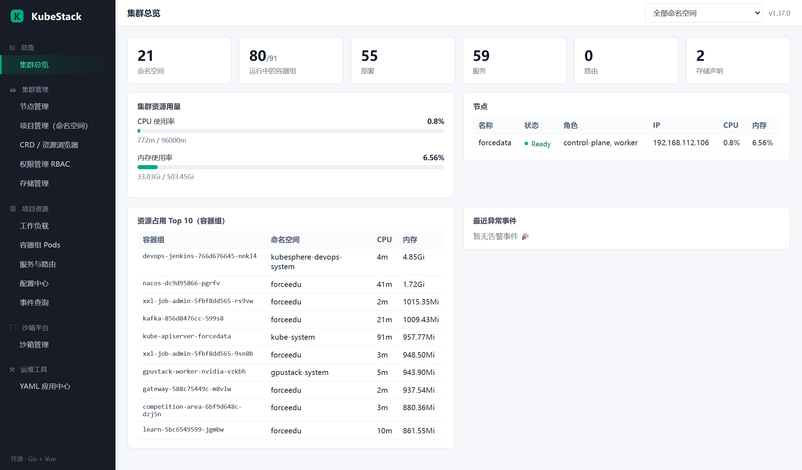
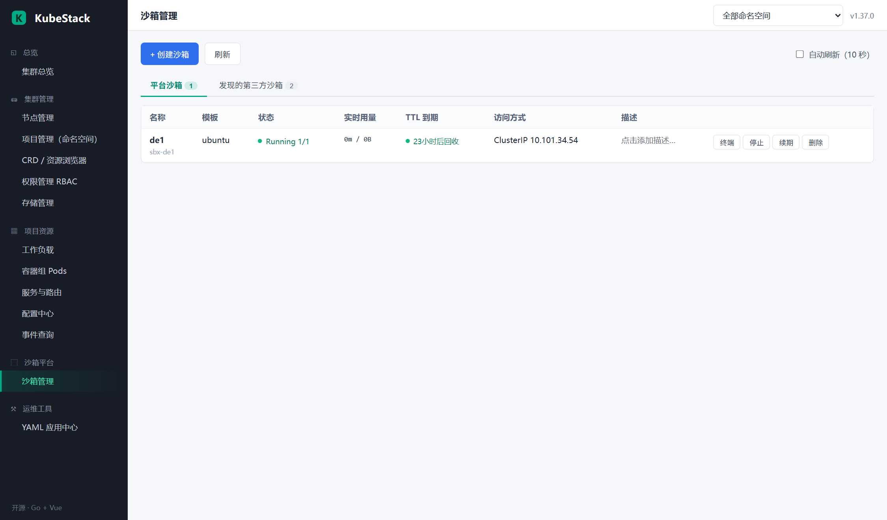
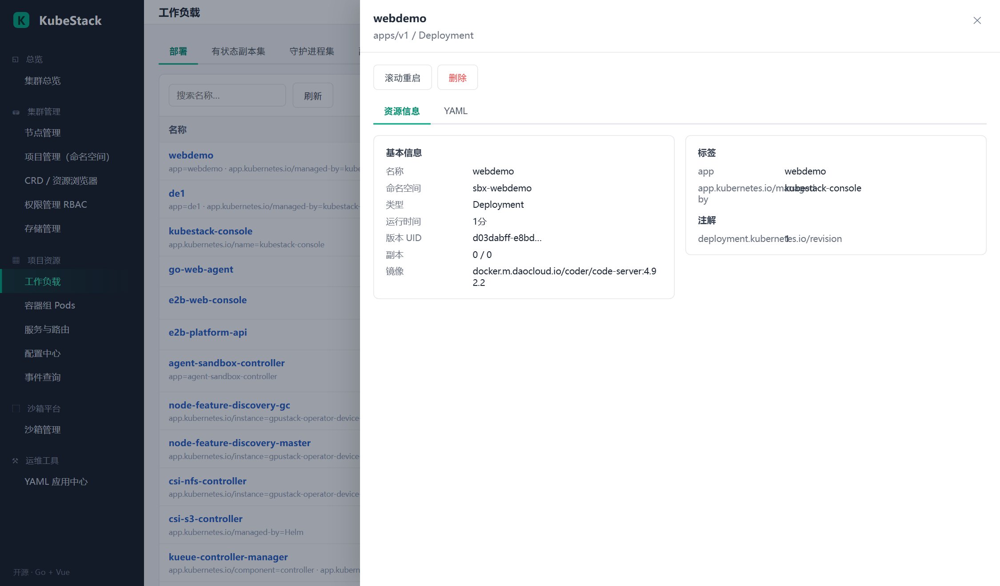
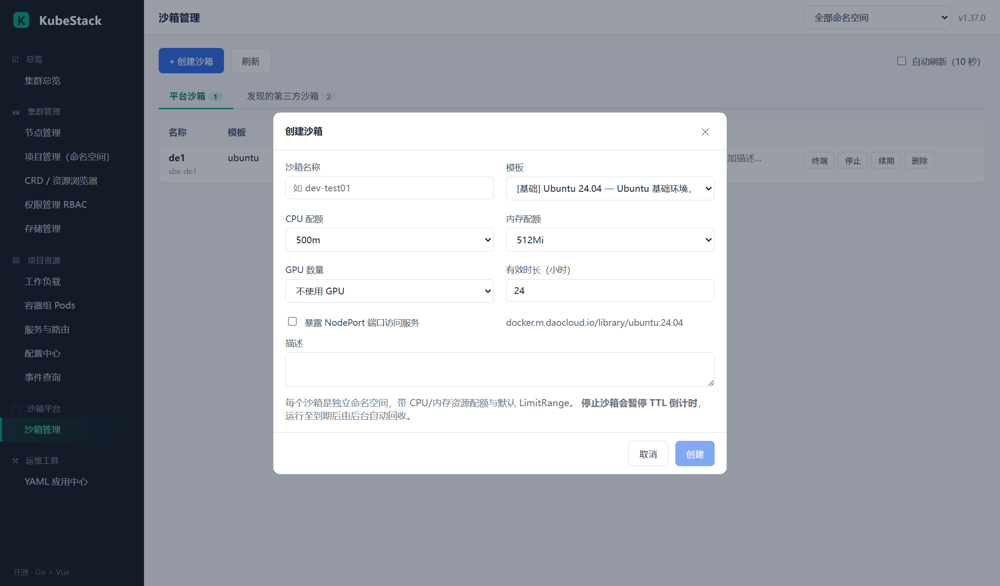

[简体中文](README.md) | [English](README.en.md)

# KubeStack Console（k8s-stack）

对标 KubeSphere 使用体验的开源 Kubernetes 管理平台，使用 **Go (client-go) + Vue 3** 构建，内置**沙箱管理**平台。单二进制部署，前端嵌入二进制，无需外部数据库。


## 项目介绍

KubeStack Console 面向想要一个轻量 Kubernetes 控制台的运维 / 开发团队：一个 Go 进程搞定一切，前端静态资源直接嵌入二进制，凭在集群内的 ServiceAccount（或本地 KUBECONFIG）访问 API Server，不依赖 MySQL 等外部组件。

它提供集群总览、节点 / 项目 / 工作负载 / 服务路由 / 配置 / 存储 / 权限等常规管理面，并通过基于 discovery 的**通用资源引擎**管理集群里的任意 API 资源——包括任意 Operator 注册的 CRD，无需改代码。亮点是内置**沙箱管理**：一键创建带 CPU / 内存 / GPU 配额和 TTL 的隔离命名空间，7 种内置模板（含 code-server 网页版 VS Code），到期自动回收。

## 📸 界面预览

| 集群总览 | 沙箱管理 |
| --- | --- |
|  |  |

| 工作负载详情 | 沙箱创建 |
| --- | --- |
|  |  |

更多：[容器组日志与终端](docs/screenshots/pods.png)、[YAML 应用中心](docs/screenshots/yaml-apply.png)（位于 docs/screenshots/）。

## ✨ 功能特性

| 模块 | 能力 |
| --- | --- |
| 集群总览 | 资源计数、CPU/内存实时用量（metrics-server）、节点健康、Top Pods、告警事件 |
| 节点管理 | 列表/详情、条件与健康、cordon / uncordon |
| 项目管理 | 命名空间（项目）CRUD、全局命名空间切换作用域 |
| 工作负载 | Deployment / StatefulSet / DaemonSet / ReplicaSet / Job / CronJob / HPA：列表、详情、YAML 编辑、滚动重启、扩缩容、删除 |
| 容器组 Pods | 状态识别（Waiting 原因/重启数/节点/IP）、实时日志流（follow）、**网页终端 exec**、YAML 查看 |
| 服务与路由 | Service（NodePort 高亮）/ Ingress / EndpointSlice |
| 配置中心 | ConfigMap / Secret 管理 |
| 存储管理 | PVC / PV / StorageClass |
| 权限管理 | ServiceAccount / Role / RoleBinding / ClusterRole / ClusterRoleBinding |
| CRD 浏览器 | 发现集群全部 API 资源（含任意 Operator CRD）并做通用 CRUD 与 YAML 编辑 |
| 事件查询 | 全局/项目范围过滤、类型过滤、自动刷新 |
| YAML 应用中心 | 多文档 YAML 在线应用（语义同 kubectl apply），创建或更新 |
| **沙箱管理** | 见下节 |

### 沙箱管理

- **一键创建隔离环境**：独立命名空间 + ResourceQuota + LimitRange + 工作负载，支持 CPU/内存配额、**GPU 数量**（`nvidia.com/gpu`，1-8，需集群安装 device plugin）、TTL 有效时长
- **7 种内置模板**：Ubuntu 24.04 / Alpine 3.20 / Python 3.12 / Node.js 22 / **VS Code 网页版（code-server）** / Nginx / Redis 7，带端口与启动参数
- **TTL 智能回收**：后台 janitor（每 60 秒）自动清理到期命名空间；**停止沙箱即暂停倒计时**（paused），重新启动后继续计时，还可续期（renew）
- **可观测**：实时 CPU/内存用量（metrics-server）、到期倒计时、自动刷新
- **访问**：NodePort 服务自动分配并生成可点击直链；描述支持行内编辑
- **网页终端**：沙箱内直接开 shell（bash/sh 自动回退）
- **第三方沙箱发现**：自动列出集群中已有的 E2B/OpenSandbox Pod 与 `agents.x-k8s.io` Sandbox CR

## 🏗 架构

```
浏览器 (Vue3 SPA)
  │ REST /api/res/** 通用资源引擎     WebSocket /ws/exec/** 终端
  ▼
Go 单进程 (gin + client-go dynamic/discovery/remotecommand)
  │ in-cluster ServiceAccount（默认）或 KUBECONFIG
  ▼
Kubernetes API Server
```

* **通用资源引擎**：基于 discovery 缓存动态解析所有 `group/version/resource`，核心组、扩展组与 CRD 无需改代码即可管理。
* **凭据策略**：源码不包含任何密码/证书；集群访问凭证由容器运行时通过 ServiceAccount token 自动挂载获得。可选登录口令经 `ADMIN_PASSWORD` 环境变量（Secret 注入）启用，登录态为内存型 Bearer Token。

## 🚀 快速开始

### 在 Kubernetes 上安装（目标节点需 docker + containerd）

```bash
git clone <repo> k8s-stack && cd k8s-stack
./deploy/install.sh                              # 构建并部署，未设 ADMIN_PASSWORD 时自动生成随机密码
ADMIN_PASSWORD='你的强密码' ./deploy/install.sh   # 或自定义管理员密码
```

安装流程：docker 多阶段构建镜像 → 导入 containerd（`k8s.io` 命名空间）→ 写入 Secret → `kubectl apply`。完成后访问 `http://<节点IP>:30885`（命名空间 `kubestack-console` 所在的 `kubestack-system`）。

### 本地开发

```bash
cd go-backend && GOPROXY=https://goproxy.cn,direct go build .
KUBECONFIG=/path/to/kubeconfig PORT=8080 ./kubestack-console

# 前端改动后重新嵌入
rm -rf go-backend/web/dist && cp -r frontend go-backend/web/dist
cd go-backend && go build .
```

### 配置项（环境变量）

| 变量 | 默认 | 说明 |
| --- | --- | --- |
| PORT | 8080 | HTTP 监听端口 |
| ADMIN_PASSWORD | 空（关闭鉴权） | 非空时启用登录鉴权 |
| DISCOVERY_NAMESPACE | opensandbox | 第三方沙箱 Pod 的发现命名空间 |

## 🛠 技术栈

| 端 | 技术 |
| --- | --- |
| 后端 | Go、Gin、client-go 0.37（dynamic / discovery / remotecommand）、gorilla/websocket |
| 前端 | Vue 3（内置 vendor 离线可用）、xterm.js 终端 |
| 部署 | Docker 多阶段构建、containerd 镜像导入、kubectl 清单、NodePort 30885 |

## 📁 目录结构

```
go-backend/          Go 服务端（internal/server: HTTP+WS, internal/sandbox: 沙箱引擎）
frontend/            Vue3 单页应用（vendor 内置 Vue/xterm，离线可用）
deploy/              manifests.yaml + Dockerfile + install.sh
docs/screenshots/    界面截图
```

## ⚠️ 安全说明

* 仓库内不含任何密钥、kubeconfig 或密码字面量。
* 集群角色绑定为 cluster-admin（对标 KubeSphere 平台管理面所需权限），生产环境可按需收敛 ClusterRole。
* Web 终端/日志入口在启用鉴权后同样受 Bearer Token 保护。

## 📄 License

仓库未包含 LICENSE 文件，暂未声明开源许可证，使用前请与作者确认。
